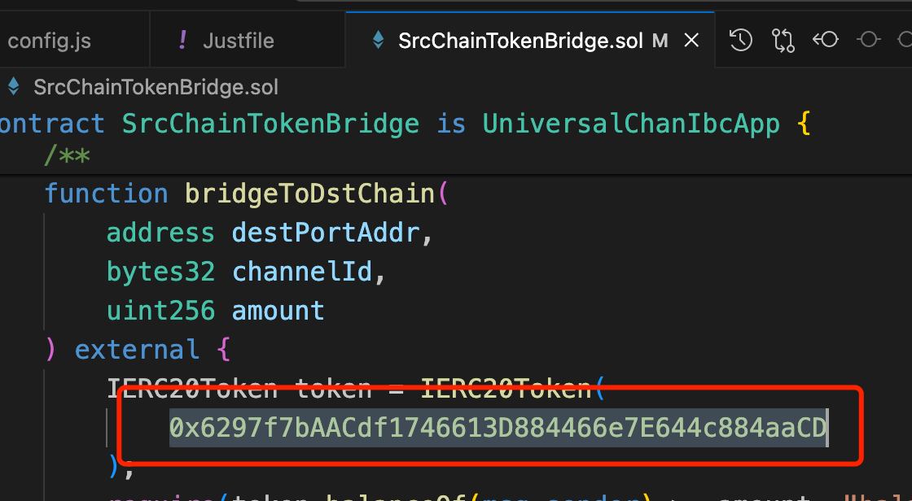
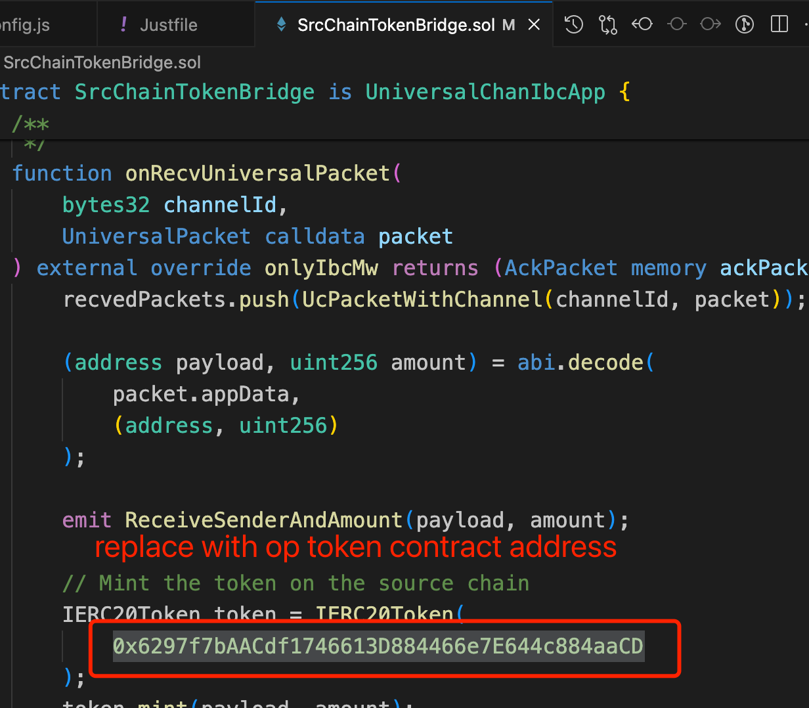
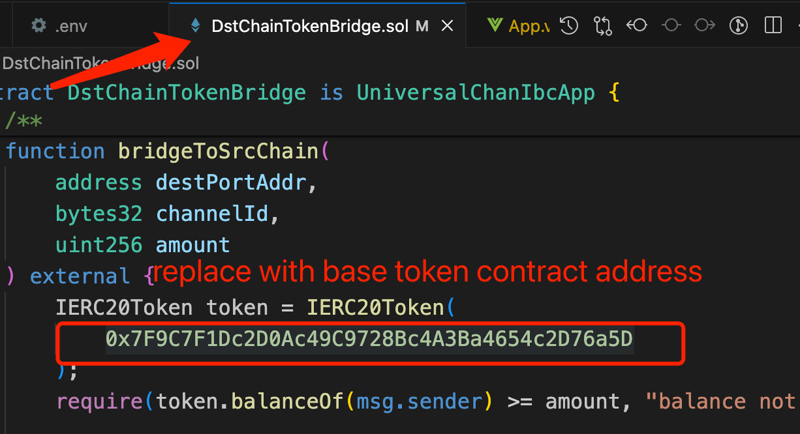
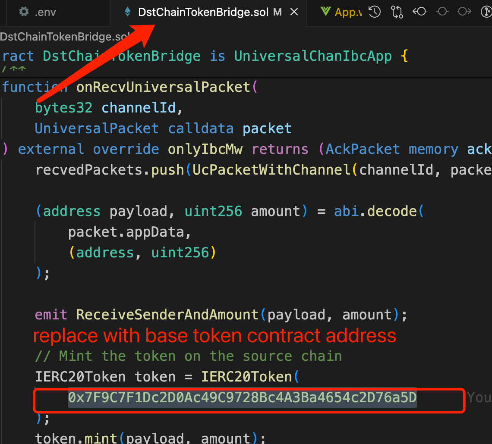
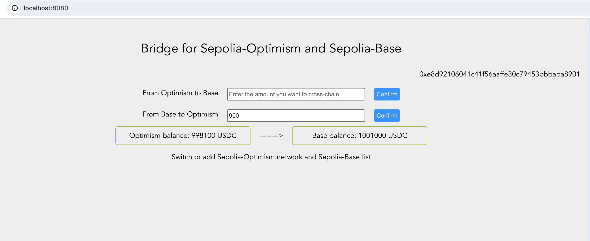

# Phase 1 repo project: Cross-chain Proof of ERC20 token
Polymer ERC20 token

### Team members
- @Jayce - Developer

## Description
I attempted to create a cross-chain bridge between Optimism and Base using the official library, and then created the same ERC20 token on both chains, allowing users to perform cross-chain operations on each chain respectively.

Features: 
- Uses Polymer x IBC as the cross-chain format
- Deploy an ERC20 token across multiple chains, where the total quantity issued on all chains combined equals the total quantity to be issued on the blockchain. The token can be sent from any one chain to another.

## Resources used

The repo uses the [demo-dapps](https://github.com/polymerdao/demo-dapps) as starting point and adds custom contracts SrcChainTokenBridge and DstChainTokenBridge that implement the custom logic.

It added an erc20-demo and vue-demo projects as token and frontend projects, modifying files such as arguments.

Additional resources used:
- Hardhat
- Blockscout
- Vue.js
- bignumber.js
- web3.js
- @open-ibc/vibc-core-smart-contracts


## Steps to reproduce

1. deploy ERC20 contract
Go to erc20-demo, config your hardhat.config.js, add your private key, then install deps, compile source code, deploy bytecode
```
cd erc20-demo
npm install
npx hardhat compile 
npx hardhat run scripts/deploy.js --network optimism
npx hardhat run scripts/deploy.js --network base
```
then you will get two erc20 token contract address
(op: 0x6297f7bAACdf1746613D884466e7E644c884aaCD)
(base: 0x7F9C7F1Dc2D0Ac49C9728Bc4A3Ba4654c2D76a5D)

2. replace erc20 token addresses in bridge contract





3. deploy bridge contract
And add your private key to the .env file (rename it from .env.example).
```
cd ..
just install 
just compile
just deploy optimism base
```
4. You will get 2 contract addresses as port address
(op: 0x27f34EF4b824884F63f69b6E59948C1E599CdA5B)
(base: 0x6297f7bAACdf1746613D884466e7E644c884aaCD)
5. Set the port address as the administrator:
```
node scripts/auth.js op
node scripts/auth.js base
```
6. run frontend page
```
cd vue-demo
npm install && npm run serve
```
See http://localhost:8080/
6. Add erc20 token to op and base with metamask
    op: 0x6297f7bAACdf1746613D884466e7E644c884aaCD
    base: 0x7F9C7F1Dc2D0Ac49C9728Bc4A3Ba4654c2D76a5D

## Proof of testnet interaction

After following the steps above you should have interacted with the testnet. You can check this at the [IBC Explorer](https://explorer.ethdenver.testnet.polymer.zone/).

Here's the data of our application:

- SrcChainTokenBridge (OP Sepolia) : 0x27f34EF4b824884F63f69b6E59948C1E599CdA5B
- DstChainTokenBridge (Base Sepolia): 0x6297f7bAACdf1746613D884466e7E644c884aaCD
- Channel (OP Sepolia): channel-10
- Channel (Base Sepolia): channel-11

- Proof of Testnet interaction:
    - [SendTx](https://optimism-sepolia.blockscout.com/tx/0xb19cb4c218b10371f474745130bd41a4c4eea8c014816745dc9253d2b9a317d7?tab=index)
    - [RecvTx](https://base-sepolia.blockscout.com/tx/0x20dbe9f57289bbc13532e3dd3c486aef358919e429a5c6aaefd676b9f8bc0ea1)
    

## Challenges Faced

- I am not in the same time zone as the core developers; when encountering issues and seeking solutions in the community, timely responses are not received.

## What we learned

How to make the first dApp using Polymer.

### Future Improvements
- I will refactor the smart contract code
- remove unnecessary demo code
- integrate the bridge and ERC20 into one contract
- improve the UI.

### Licence
[Apache 2.0](LICENSE)


